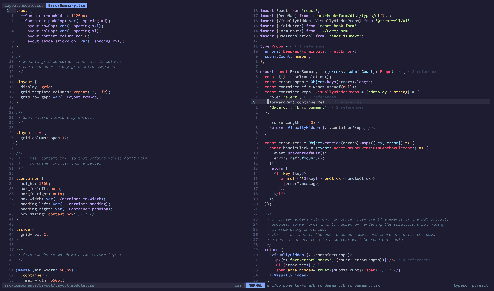

# material.vim

A dark color scheme for Vim/Neovim forked from the [Material](https://github.com/kaicataldo/material.vim) color scheme. This is my own customised version with some additional influence from [Embark](https://embark-theme.github.io/).



## Installation

Using [vim-plug](https://github.com/junegunn/vim-plug) (modify this to work with your Vim package manager of choice):

```vim
Plug 'simonsmith/material.vim'
```

## Usage

To enable this color scheme, add the following to your Vim (`~/.vimrc`) or Neovim (`~/.config/nvim/init.vim`) configuration:

```vim
set background=dark
colorscheme material
```

### True Colors

True colors are a requirement for this color scheme to work properly. To enable this, place the following in your `~/.vimrc` or `~/.config/nvim/init.vim` file:

```vim
if (has("nvim"))
  "For Neovim 0.1.3 and 0.1.4 < https://github.com/neovim/neovim/pull/2198 >
  let $NVIM_TUI_ENABLE_TRUE_COLOR=1
endif

"For Neovim > 0.1.5 and Vim > patch 7.4.1799 < https://github.com/vim/vim/commit/61be73bb0f965a895bfb064ea3e55476ac175162 >
"Based on Vim patch 7.4.1770 (`guicolors` option) < https://github.com/vim/vim/commit/8a633e3427b47286869aa4b96f2bfc1fe65b25cd >
" < https://github.com/neovim/neovim/wiki/Following-HEAD#20160511 >
if (has("termguicolors"))
  set termguicolors
endif
```

### Italics

To turn off italics, configure as follows:

```vim
let g:material_terminal_italics = 0
```

### vim-airline & lightline.vim

The included vim-airline and lightline.vim themes will change to match the theme option specified.

To use the included [vim-airline](https://github.com/vim-airline/vim-airline) theme:

```vim
let g:airline_theme = 'material'
```

To use the included [lightline.vim](https://github.com/itchyny/lightline.vim) theme:

```vim
let g:lightline = { 'colorscheme': 'material_vim' }
```

Note: The included theme is called `material_vim` because lightline.vim comes with its own version of a material theme (which does not change based on the theme version selected).

### iTerm2 Color Scheme

Corresponding iTerm2 color schemes are included in this repo. You can find them [here](https://github.com/kaicataldo/material.vim/tree/master/iterm2/).
